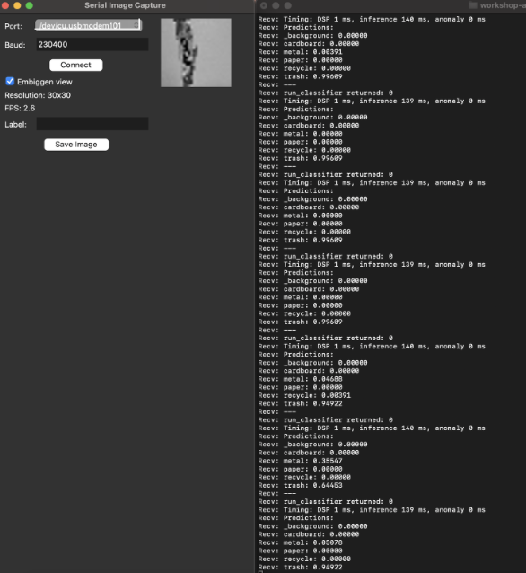

# AI Hardware Project 
ECE 4332 / ECE 6332 — AI Hardware  
Fall 2025

# TinyML: Waste Sorting Visual Classifier

## Team Information

**Team Name:** Masters of Eng-AI

**Team Members:**
- Martha Michael
- Yatzil Romero Rodriguez
- Meng Xu

---

## Project Information

### Project Title
TinyML: Waste Sorting Visual Classifier

### Background
Traditional waste sorting systems frequently fall short, as many individuals seem to struggle to differentiate between various waste. To tackle this challenge, we propose a more user-friendly solution that simplifies proper waste disposal and separation. Our approach centers on developing a fast, efficient visual waste classification system capable of accurately identifying and categorizing materials into five primary waste categories: cardboard, metal, paper, recyclable plastic, and trash. An additional category of background is included as a default for when no waste is shown to the camera.

### Key Objective
Using a TinyML model and an onboard camera, we plan to build a real-time image classification system that operates directly on embedded hardware. The goal is to design and deploy a lightweight model that can accurately categorize waste without relying on cloud-based processing. This problem is highly relevant to AI hardware, as it tests the limits of efficiency and latency while demonstrating how AI can be both environmentally sustainable and hardware-efficient for real-world edge applications. Our goal is to obtain an accuracy greater than 75% with an inference time below one second, and to overall reduce power usage.

---

## Implementation

### Technology Stack
For this project, the selected platform was the **Arduino Nano 33 BLE Sense Lite**, chosen for its integrated sensors and BLE connectivity, along with the **OV7675 camera module**, which provides direct visual input for classification tasks without the need for external processors or cloud resources.

### Software Requirements
Additionally, the system hardware (Arduino) was flashed using the Arduino IDE to support the camera module and the deployment model.

### Supportive Files
For this project, the following files were used and are included in our GitHub repository:

- **Arduino_OV767X.zip** - Camera library for Arduino Nano 33 BLE Sense to communicate with the OV7675 camera module
- **serial-image-capture.py** - Python serial that provides a GUI for capturing images from the Arduino camera via serial connection
- **nano33_tinyml_kit_image_serial.ino** - Arduino sketch that captures images from the camera and transmits them as base64-encoded data over serial
- **base64.h** - Header file for base64 encoding functionality
- **ei-image-augmentation.ipynb** - Google Colab notebook for data augmentation and automatic upload to Edge Impulse
- **nano33_camera_live_inference.ino** - Arduino sketch for performing real-time interference with the deployed model

---

## Getting Started

### Clone the Repository
```bash
git clone <repo-url>
cd <ai-hardware-project-proposal-masters-of-eng-ai>
```

### Install Python Dependencies
```bash
python3 -m pip install Pillow pyserial
```

### Data Capture
Navigate to your project directory and run:
```bash
python3 serial-image-capture.py
```

After running the serial image capture and collecting your images, exiting out of the GUI window saves all your recorded images into a single folder. Zip them into a dataset:
```bash
zip -FS -r dataset.zip *.png
```

Then upload `dataset.zip` to the `ei-image-augmentation.ipynb` Google Colab notebook and run all cells to perform data augmentation and automatically upload to Edge Impulse.

---

## Model Training

Edge Impulse was used to train the model, as it is a free AI development platform that allows users to easily create models compatible with the Arduino Nano 33 BLE Sense board.

### 1. Data Collection
For this project, we used the OV7675 camera module and Serial Image Capture tool to collect images of waste materials for training the classification model. We captured approximately **50 images per category** across six categories: cardboard, metal, paper, recyclable plastic, trash, and background. All collected images were saved as **30x30 grayscale PNG files** and zipped into `dataset.zip`. This dataset (filename: dataset-masters_of_eng-ai.zip) is included in our GitHub repository and contains all images needed to train the waste classification model.


### 2. Data Augmentation
Using the `ei-image-augmentation.ipynb` Google Colab notebook (included in our repository), we augmented the collected waste images to generate more training data and to make our model robust. This notebook automatically:
- Applies transformations (flipping, rotation, zooming, translation, noise addition)
- Generates multiple augmented versions of each original image
- Uploads the full augmented dataset to Edge Impulse
- Splits the data into training (76%) and testing (24%) sets

### 3. Creating the Impulse in Edge Impulse
In Edge Impulse, you will see that the newly generated set of images will appear under the Data Acquisition section. The notebook also automatically split the data into training and testing sets, categorized by label.

- **Under Impulse Design > Create impulse:** Image dimensions of 30px by 30px is set, followed by an Image processing block, and a Classification learning block. The impulse is then saved.
- **Under Impulse Design > Image:** The color depth is set to grayscale to reduce computational complexity. The parameters are then saved, and corresponding features are generated.
- **Under Impulse Design > Classifier:** The default neural network settings is changed to have 100 training cycles (epochs). The model is then saved and trained.

---

## Deployment

To deploy the Edge Impulse model to the Arduino board, follow these steps:

### Download the Model
1. After training is complete and model performance is satisfactory, navigate to the **Deployment** tab in your Edge Impulse project.
2. Search for "Arduino" in the deployment options and select **Arduino library**.
3. Scroll down and ensure:
   - **EON Compiler** is enabled (converts model to optimized C++ code)
   - **Quantized (int8)** is selected (reduces model size and improves inference speed)
4. Click **Build**. This will download a `.zip` Arduino library file containing your trained model.

### Install the Library
5. In Arduino IDE, go to **Sketch > Include Library > Add .ZIP Library**.
6. Select the downloaded Edge Impulse library `.zip` file and click **Open**.

### Upload Inference Code
7. Open the sketch `nano33_camera_live_inference.ino` from the project files.
8. At the top of the file, update the `#include` line with your Edge Impulse library name (e.g., `#include <Masters_of_Eng-AI_inferencing.h>`).
9. Confirm your Arduino board is connected via USB.
10. Select **Tools > Board > Arduino Mbed OS Nano Boards > Arduino Nano 33 BLE**.
11. Select **Tools > Port** and choose the correct port for your Arduino.
12. Click **Upload**. Note: Compilation may take 5-10 minutes due to the model size.

### Test Live Inference
13. Once the upload is complete, open a terminal and navigate to your project directory.
14. Run the Serial Image Capture script:
    ```bash
    python3 serial-image-capture.py
    ```
15. Select the Arduino's serial port from the Port dropdown menu and click **Connect**. Click the **Embiggen view** to enlarge the camera feed.
16. Point the camera at different waste items. In the terminal window, you will see real-time classification results showing the predicted category and confidence scores for each waste type.

The label with the highest confidence score is the model's prediction for the waste category.

---

## Results

Waste sorting classification was performed directly using the OV7675 camera on the Arduino device. Each image was labeled into one of five categories: cardboard, metal, paper, recyclable plastic, and trash. The classification was conducted using different types of waste placed against the same background.

### Performance Metrics
Our results show that the Arduino OV7675 camera successfully identifies the five waste categories:
- **Classification Accuracy:** 75% to 99% (meeting/exceeding our 75% accuracy objective)
- **Inference Time:** Under 140 ms (well below our one-second target)
- **Power Reduction:** Using a quantized (int8) model instead of an unoptimized (float32) model reduces model complexity and ultimately reduces power consumption on the lightweight TinyML board

The difference between the two optimization models in terms of peak RAM usage and flash usage demonstrate the power efficiency gains.

### Classification Examples

#### Background
Default category for when no waste is shown (e.g., blank light-colored wall)

- Accuracy: ~99.6%
#### Cardboard
Example: Part of a box

- Accuracy: ~99.6%

#### Metal
Example: Energy drink can

- Accuracy: ~80-98%

#### Paper
Example: Printer copy paper

- Accuracy: ~99.6%

#### Recycle (Recyclable Plastic)
Example: Water bottle

- Accuracy: ~97-99%

#### Trash
Examples: Candy wrappers, granola bar wrappers

- Accuracy: ~97% (after stabilization)

**Note:** Some discrepancies in the accuracies for metal and trash categories are a result of the transition between background or previous object and the new object to be classified. The accuracy and detection remain steady after some time.

---

## Troubleshooting

### Camera Connectivity Issues
If you experience camera connectivity problems:
1. Make sure the Arduino board is placed in the correct orientation on its respective adapter board from the kit.
2. If this doesn't help, do the following:
   - Unplug the microUSB cable from the computer
   - Close the Arduino IDE
   - Plug the cable back in
   - Quickly re-run Serial Image Capture
   - Change Port (if needed)
   - Turn on Embiggen view
   - Click Connect
